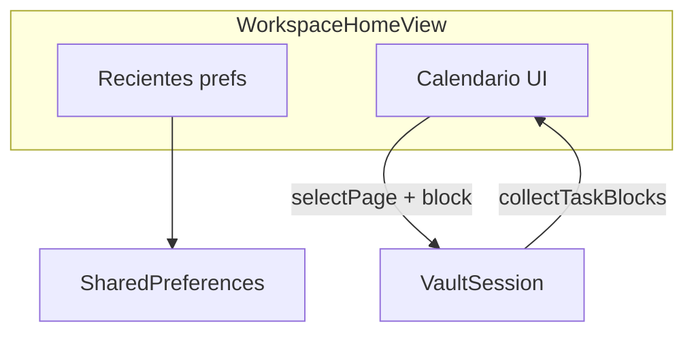

# Pantalla de inicio (estilo Notion) + calendario de tareas + IA

## Contexto en el código

- Tras desbloquear, el cuerpo principal es [`WorkspacePage`](lib/features/workspace/shell/workspace_page.dart), que usa [`WorkspaceEditorSurface`](lib/features/workspace/shell/workspace_editor_surface.dart).
- Si `session.selectedPage` es `null`, ya se muestra [`_WorkspaceEmptyState`](lib/features/workspace/shell/workspace_editor_surface.dart). El atajo **cerrar página** ya llama a [`clearSelectedPage()`](lib/session/vault_session.dart).
- El [`Sidebar`](lib/features/workspace/shell/sidebar.dart) ya mantiene recientes en `SharedPreferences` (solo ids); conviene unificar con timestamps y **localizar** el título (hoy `"Recientes"` está hardcodeado).
- Búsqueda global: [`GlobalSearchPopup`](lib/features/workspace/search/global_search_popup.dart) vía [`_handleSearchRequested`](lib/app/folio_app.dart).
- **Tareas con fecha**: [`FolioTaskData`](lib/models/folio_task_data.dart) ya tiene `dueDate` y `startDate` (ISO `YYYY-MM-DD`). [`VaultSession.collectTaskBlocks`](lib/session/vault_session.dart) devuelve [`VaultTaskListEntry`](lib/models/vault_task_list_entry.dart) en todo el vault — base ideal para un calendario sin nuevo modelo de datos.
- **Kanban** ya tiene vistas que usan fechas (p. ej. timeline en [`kanban_board_page.dart`](lib/features/workspace/kanban/kanban_board_page.dart)); el calendario de inicio puede reutilizar estilos/helpers de formato de fecha donde encaje.

---

## Fase 1 — Inicio (recientes, reloj, buscador)

1. **Persistencia unificada de recientes con timestamp**  
   - Módulo (p. ej. [`lib/features/workspace/recent_page_visits.dart`](lib/features/workspace/recent_page_visits.dart)): modelo `pageId` + `visitedAtMs`, **migración** desde `StringList` de ids en la clave actual del sidebar, límite ~6, filtrar páginas borradas.
   - Actualizar [`sidebar.dart`](lib/features/workspace/shell/sidebar.dart) para usar este módulo.

2. **Nueva UI de inicio**  
   - Sustituir `_WorkspaceEmptyState` por `WorkspaceHomeView`: fecha/hora localizada (`intl`), saludo/título (ARB), buscador que dispara `onOpenSearch`, lista de recientes con hora de visita, acciones crear página / buscar.
   - Cablear [`WorkspaceEditorSurface`](lib/features/workspace/shell/workspace_editor_surface.dart) + [`workspace_page.dart`](lib/features/workspace/shell/workspace_page.dart) con `onSelectPage` / `session` según haga falta.

3. **Localización**  
   - Cadenas nuevas en todos los [`lib/l10n/*.arb`](lib/l10n/); regenerar l10n. Incluir sustitución de textos hardcodeados del estado vacío actual y del sidebar.

4. **Opcional — “Abrir en inicio”**  
   - Preferencia en [`AppSettings`](lib/app/app_settings.dart) + toggle en [`settings_page.dart`](lib/features/settings/settings_page.dart): si está activa, tras desbloquear `selectedPageId == null` (no restaurar última página). Por defecto `false`.

---

## Fase 2 — Calendario de tareas (fechas `dueDate` / `startDate`)

**Objetivo:** vista mensual (y detalle por día) de tareas del vault que tengan al menos una fecha; al pulsar una tarea, navegar a la página y, si el código ya lo permite, enfocar el bloque.

1. **Agregación**  
   - Usar `session.collectTaskBlocks(includeSimpleTodos: false)` o `true` según producto: los `todo` simples **no** tienen `dueDate` en el modelo; el calendario se centra en bloques `task` con `dueDate` y/o `startDate`.  
   - Normalizar a `DateTime` con `DateTime.tryParse` en fecha local (mismo criterio que Kanban).

2. **UI**  
   - Añadir dependencia tipo **`table_calendar`** (valorar licencia/tamaño) **o** rejilla mensual propia con `Material` / `GridView` para no añadir paquete.  
   - Incrustar el calendario en la **misma pantalla de inicio** (debajo de recientes) o en una sub-sección expandible “Esta semana / mes” para no saturar móvil.  
   - Indicadores por día (puntos o contador) cuando hay tareas. Lista bajo el calendario o bottom sheet al seleccionar día.  
   - Al elegir tarea: `session.selectPage(entry.pageId)` y, si existe API, `pendingScrollToBlockId` / equivalente en `VaultSession` para saltar al bloque.

3. **Localización**  
   - Nombres de meses/días vía `intl` + ARB para etiquetas (“Tareas”, “Sin fecha”, “Vence”, “Inicio”, vacíos).

4. **Coherencia con recordatorios**  
   - [`task_reminder_service.dart`](lib/services/tasks/task_reminder_service.dart) ya usa `dueDate`; el calendario es solo lectura/navegación — no duplicar lógica de alarmas.

---

## Fase 3 — IA (alcance acotado y opcional)

Evitar un segundo motor de NLP hasta que el producto lo pida; apoyarse en la IA ya integrada (Quill / panel de chat) y en datos locales.

1. **Atajo contextual desde inicio**  
   - Botón o chip en `WorkspaceHomeView`: “Preguntar a la IA…” (texto en ARB) que abre el flujo de chat existente con **prompt inicial** sugerido, p. ej. resumen de tareas con vencimiento esta semana / vencidas, generado en Dart a partir de `collectTaskBlocks` (lista textual) para no enviar más de lo necesario.  
   - Respetar [`AppSettings`](lib/app/app_settings.dart) / flags de IA desactivada o modo nube: si IA deshabilitada, ocultar el chip o mostrar mensaje localizado.

2. **No incluido en primera entrega (posible Fase 4)**  
   - Extracción automática de fechas desde párrafos (“el viernes…”) con modelo.  
   - Creación de tareas solo desde lenguaje natural sin confirmación.

---

## Diagrama de datos (inicio + calendario)

---

## Archivos previstos (resumen)

| Área | Archivos |
|------|----------|
| Recientes | Nuevo `recent_page_visits.dart`; [`sidebar.dart`](lib/features/workspace/shell/sidebar.dart) |
| Inicio | [`workspace_editor_surface.dart`](lib/features/workspace/shell/workspace_editor_surface.dart), [`workspace_page.dart`](lib/features/workspace/shell/workspace_page.dart) |
| Calendario | Nuevo p. ej. `workspace_task_calendar.dart` o sección en `workspace_home_view.dart`; posible `pubspec` si se elige paquete |
| IA | [`workspace_page.dart`](lib/features/workspace/shell/workspace_page.dart) / callback existente al panel de chat; strings ARB |
| L10n | [`lib/l10n/*.arb`](lib/l10n/) |
| Opcional apertura | [`app_settings.dart`](lib/app/app_settings.dart), [`settings_page.dart`](lib/features/settings/settings_page.dart) |

---

## Orden de implementación sugerido

1. Recientes + migración + home base (Fase 1).  
2. Calendario sobre `collectTaskBlocks` (Fase 2).  
3. Chip/prompt IA desde inicio (Fase 3).  
4. Ajuste “abrir en inicio” si se desea.

---

## Todos

- [ ] **recent-prefs**: `recent_page_visits.dart` + sidebar  
- [ ] **home-ui**: `WorkspaceHomeView` + cableado surface/page  
- [ ] **l10n**: ARB + gen  
- [ ] **task-calendar**: agregación + widget mensual + navegación a página/bloque  
- [ ] **home-ai-shortcut**: chip + prompt inicial condicionado a IA habilitada  
- [ ] **optional-setting**: “Abrir en inicio” en ajustes  
